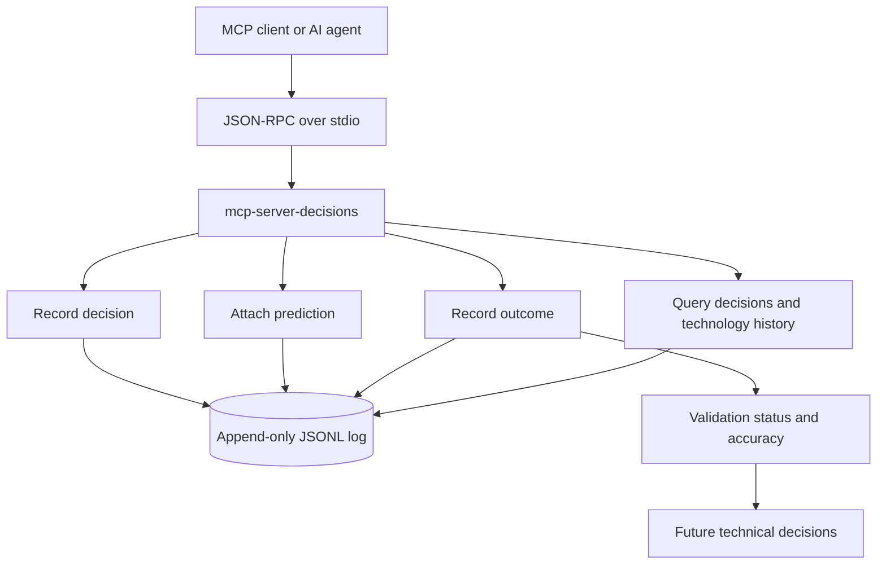

<!-- mcp-name: io.github.Roberton003/mcp-server-decisions -->

# 🧠 MCP Server: Decisions

An open-source MCP server that helps teams record architectural decisions, connect them to testable predictions, and validate outcomes over time. It gives AI agents and developers a lightweight, auditable memory for technical choices.

[](https://www.python.org/)
[](https://modelcontextprotocol.io/)
[](LICENSE)
[](https://pypi.org/project/mcp-server-decisions/)



## ✨ Project Highlights

- **Outcome-linked decisions** — connect each technical choice to measurable predictions and observed results.
- **In-band outcome gates** — tool responses identify predictions that still need validation before the work is considered complete.
- **Portable storage** — append-only JSONL keeps the log inspectable, easy to back up, and free from database setup.
- **Zero runtime dependencies** — Python's standard library is enough to run the server.
- **MCP-native interface** — expose decision tracking through JSON-RPC over stdio to MCP-compatible clients.
- **Technology feedback** — aggregate validated outcomes to inform future technology choices.

## 🧰 Technical Stack

| Layer | Technology |
|---|---|
| Protocol | Model Context Protocol over JSON-RPC 2.0 |
| Runtime | Python 3.10+ |
| Storage | Append-only JSONL file |
| Packaging | PyPI / Hatchling |
| Testing | Built-in self-test command |
| License | MIT |

## 🔄 Architecture



## 📌 What It Provides

The server exposes four tools:

| Tool | Purpose |
|---|---|
| `record-decision` | Store the problem, chosen solution, alternatives, technologies, and predictions. |
| `record-prediction` | Add a measurable prediction to an existing decision. |
| `record-outcome` | Record the observed result and classify the prediction as success, partial success, or failure. |
| `query-decisions` | Search decisions by keyword, technology, domain, or result limit. |

### Example flow

```text
Decide → Predict → Implement → Measure → Validate → Learn
```

A decision can produce an outcome-gate reminder such as:

```json
{
  "decision_id": "DEC-2026-0001",
  "status": "OK",
  "OUTCOME_GATE": "2 prediction(s) still lack outcomes."
}
```

The reminder is a workflow signal, not a claim about adoption or measured impact. See the [Outcome Gate Pattern](docs/OUTCOME-GATE-PATTERN.md) for the design and trade-offs.

## 📊 Current Project Status

| Area | Status |
|---|---|
| Decision, prediction, and outcome tracking | Available |
| Outcome-gate reminders | Available |
| Technology performance report | Available |
| PyPI package | Published as `1.0.2` |
| External adoption metrics | Not collected yet |
| Web UI and notifications | Roadmap |

The project is early-stage. Contributions, examples from real projects, and feedback are welcome.

## 🚀 Setup

### Prerequisites

- Python 3.10 or newer
- An MCP-compatible client

### Install from PyPI

```bash
python3 -m pip install mcp-server-decisions
```

### Run the self-test

```bash
python3 -m pip install -e .
python3 server.py --selftest
```

### Configure an MCP client

```json
{
  "mcpServers": {
    "mcp-server-decisions": {
      "command": "mcp-server-decisions"
    }
  }
}
```

For client-specific configuration and troubleshooting, see [Client Integrations](docs/INTEGRATIONS.md). For a guided first run, see [Quick Start](QUICKSTART.md).

### Configure the log path

By default, the server writes to `~/.local/share/mcp-decisions/decisions_log.json`. Set `MCP_DECISIONS_LOG_PATH` to use another file:

```bash
MCP_DECISIONS_LOG_PATH=/path/to/decisions.json mcp-server-decisions
```

## 🗂️ Project Structure

```text
.
├── server.py                         # MCP server and tool implementations
├── scripts/                          # Reports derived from the decision log
├── docs/                             # Architecture, examples, and integrations
├── .github/ISSUE_TEMPLATE/           # Reusable bug and feature templates
├── CONTRIBUTING.md                   # Development and contribution workflow
├── QUICKSTART.md                     # Guided setup and first decision
├── server.json                       # MCP Registry metadata
├── pyproject.toml                    # PyPI package metadata
└── LICENSE                           # MIT license
```

## 📚 Documentation

- [Quick Start](QUICKSTART.md) — install and record a first decision.
- [Client Integrations](docs/INTEGRATIONS.md) — configure MCP clients.
- [Detailed Examples](docs/EXAMPLES.md) — JSON-RPC requests and responses.
- [Architecture & Design](docs/ARCHITECTURE.md) — storage, IDs, scoring, and trade-offs.
- [Outcome Gate Pattern](docs/OUTCOME-GATE-PATTERN.md) — the reusable feedback-loop pattern.
- [Contributing](CONTRIBUTING.md) — propose fixes, features, and documentation.

## 🛣️ Roadmap

- [x] Core decision, prediction, and outcome tracking
- [x] Outcome-gate reminders
- [x] Technology performance reporting
- [ ] Web UI for browsing and searching decisions
- [ ] Notifications for low prediction accuracy
- [ ] Reusable decision templates and domain patterns

## 🤝 Contributing

Issues and pull requests are welcome. Start with [CONTRIBUTING.md](CONTRIBUTING.md), run the self-test, and explain the problem or use case in the pull request.

## 📄 License

[MIT](LICENSE) © 2026 Roberto Nascimento
